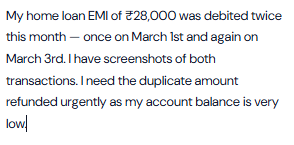
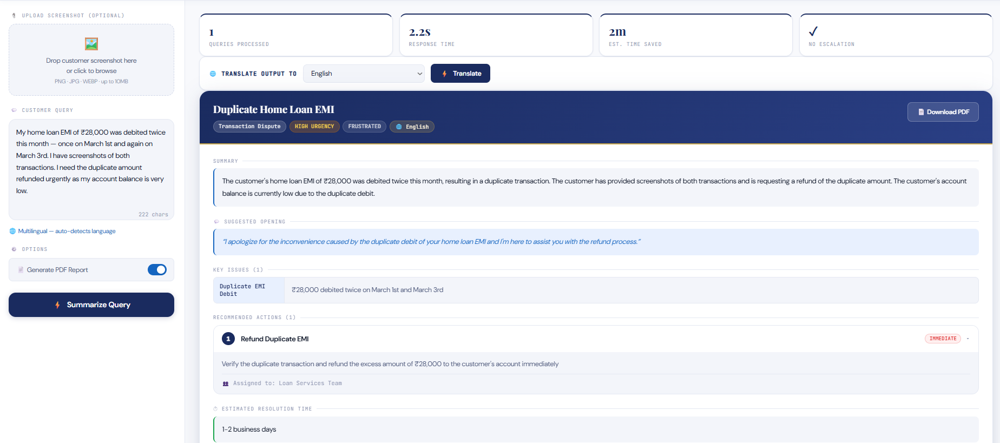
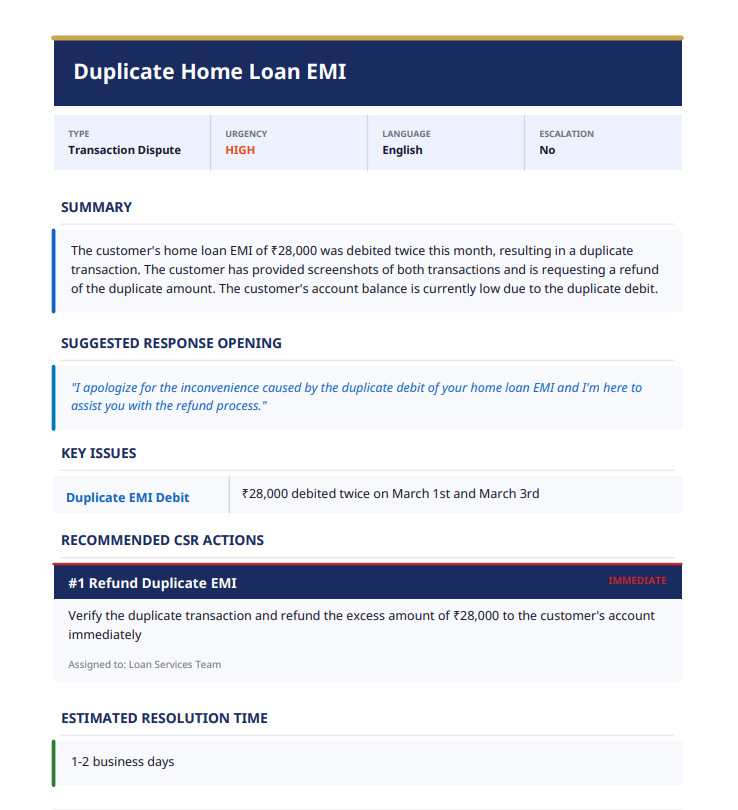

# 🏦 BankIQ Assistant — AI-powered assistance for seamless banking support

<div align="center">


**An AI-powered tool that helps Bank Customer Service Representatives (CSRs) instantly analyze, summarize, and respond to customer queries — with multilingual support, RAG-based knowledge retrieval, and automated PDF report generation.**

[📺 Watch Demo Video](#-demo) • [🚀 Quick Start](#-quick-start) • [✨ Features](#-features) • [🛠️ Tech Stack](#️-tech-stack)

</div>

---

## 📺 Demo

> 🎬 **[Click here to watch the full demo video](https://drive.google.com/file/d/1G0cD-vi4x-KQ2WuML8em3QoHRxzcDcsd/view?usp=sharing)** ← *(replace with your YouTube/Drive link)*

[](https://drive.google.com/file/d/1G0cD-vi4x-KQ2WuML8em3QoHRxzcDcsd/view?usp=sharing)

---

## ✨ Features

### 🤖 AI-Powered Analysis
- Accepts **text queries** or **screenshot images** from customers
- Automatically selects a **Vision model** when an image is uploaded
- Returns structured JSON with urgency, sentiment, key issues & recommended actions

### 🌍 Multilingual Support
- **Auto-detects** the customer's language (Hindi, Tamil, Bengali, Marathi, Telugu & more)
- Translates customer query → English for processing
- Returns response in the **customer's original language**
- CSRs can also manually translate to any supported language on demand

### 🔍 RAG (Retrieval-Augmented Generation)
- Uses **TF-IDF vector search** over a Horizon Bank knowledge base
- Only injects *relevant* KB chunks into the prompt (not the entire KB)
- Ensures accurate, grounded answers — no hallucinated rates or policies

### 📄 Auto PDF Report Generation
- Generates a **professional, branded PDF summary** for every query
- Includes urgency badge, recommended CSR actions, escalation alerts, compliance flags
- Supports Unicode fonts (Noto Sans) for multilingual PDF content

### 🚨 Smart Escalation & Compliance
- Flags **RBI compliance** requirements (e.g., 3-day zero-liability rule for fraud)
- Detects urgency levels: `critical` / `high` / `medium` / `low`
- Identifies when to escalate to specialized teams

---

## 🖥️ Application Screenshots

> *(Add your screenshots here)*

| Query Input | Analysis Result | PDF Report |
|---|---|---|
|  |  |  |

---

## 🛠️ Tech Stack

| Layer | Technology |
|---|---|
| **Backend** | FastAPI (Python) |
| **AI / LLM** | OpenAI-compatible API (Groq / Gemini / Azure) |
| **RAG** | TF-IDF + Cosine Similarity (scikit-learn) |
| **PDF Generation** | ReportLab |
| **Translation** | LLM-based auto-detection & translation |
| **Frontend** | HTML + CSS + Vanilla JS |
| **Font** | Noto Sans (Unicode, 500+ languages) |

---

## 🚀 Quick Start

### 1. Clone the Repository

```bash
git clone https://github.com/YOUR_USERNAME/BankIQ-Assistant.git
cd BankIQ-Assistant
```

### 2. Install Dependencies

```bash
pip install -r requirements.txt
```

### 3. Configure Environment

Create a `.env` file in the project root:

```env
API_KEY=your_api_key_here
API_ENDPOINT=your_api_base_url_here
```

#### 🆓 Free API Options

| Provider | Base URL | Vision Support | Free Tier |
|---|---|---|---|
| **Groq** *(Recommended)* | `https://api.groq.com/openai/v1/` | ✅ Yes | ✅ Generous |
| **Google Gemini** | `https://generativelanguage.googleapis.com/v1beta/openai/` | ✅ Yes | ✅ Yes |
| **OpenRouter** | `https://openrouter.ai/api/v1/` | ✅ Yes | ✅ Yes |

> Get a free Groq key at: [https://console.groq.com](https://console.groq.com)

### 4. Update Models in `main.py`

**For Groq:**
```python
VISION_MODEL = {
    "label":      "Llama 4 Scout Vision",
    "deployment": "meta-llama/llama-4-scout-17b-16e-instruct",
    "vision":     True,
}
TEXT_MODEL = {
    "label":      "Llama 3.3 70B",
    "deployment": "llama-3.3-70b-versatile",
    "vision":     False,
}
```

### 5. Run the Application

```bash
python main.py
```

Open your browser at: **[http://localhost:8000](http://localhost:8000)**

---

## 📁 Project Structure

```
BankIQ-Assistant/
│
├── main.py                 # FastAPI app — handles API routes, request/response, PDF generation
├── rag.py                  # RAG module — TF-IDF based document retrieval logic
├── translator.py           # Language detection & multilingual translation utilities
│
├── kb/                     # Knowledge Base folder
│   └── bank_knowledge.json # Stores bank-related data (rates, policies, fees, FAQs)
│
├── templates/              # Frontend templates (for UI rendering)
│   └── index.html          # Main user interface (chat/query page)
│
├── fonts/                  # Custom fonts for PDF generation (Unicode support)
│   ├── NotoSans-Regular.ttf
│   ├── NotoSans-Bold.ttf
│   └── NotoSans-Italic.ttf
│
├── pdfs/                   # Auto-generated PDF reports (ignored in git)
│
├── .env                    # Environment variables (API keys, configs) ⚠️ keep secret
├── requirements.txt        # Python dependencies
└── README.md               # Project documentation (recommended to add)
```

---

## 🔌 API Endpoints

| Method | Endpoint | Description |
|---|---|---|
| `GET` | `/docs` | List of all APIs |
| `GET` | `/` | Serve the frontend UI |
| `GET` | `/health` | Health check + model info |
| `POST` | `/summarize` | Analyze a customer query (text or image) |
| `POST` | `/translate` | On-demand translation to any language |
| `GET` | `/languages` | List all supported languages |
| `GET` | `/pdfs/{filename}` | Download a generated PDF report |

### Example Request

```bash
curl -X POST http://localhost:8000/summarize \
  -F "query_text=My credit card was charged twice for ₹15,000" \
  -F "generate_report=true"
```

### Example Response

```json
{
  "out_of_scope": false,
  "analysis": {
    "query_title": "Duplicate Credit Card Charge",
    "query_type": "Transaction Dispute",
    "urgency": "high",
    "customer_sentiment": "frustrated",
    "summary": "Customer reports a duplicate charge of ₹15,000...",
    "recommended_actions": [...],
    "escalation_required": true
  },
  "model_used": "Llama 4 Scout Vision",
  "pdf_url": "/pdfs/query_summary_abc123.pdf"
}
```

---

## 🌐 Supported Languages

Hindi • Marathi • Tamil • Telugu • Bengali • Gujarati • Kannada • Malayalam • Punjabi • Urdu • English • French • Spanish • Arabic • and more...

---

## ⚙️ Requirements

```
fastapi
uvicorn
openai
python-dotenv
httpx
reportlab
scikit-learn
numpy
```

Install with:
```bash
pip install fastapi uvicorn openai python-dotenv httpx reportlab scikit-learn numpy
```

---

## 🔒 Security Notes

- **Never commit your `.env` file** — it contains your API key
- The `.gitignore` already excludes `.env` and `pdfs/`
- Rotate your API key immediately if accidentally exposed

---

## 🤝 Contributing

1. Fork the repo
2. Create a feature branch: `git checkout -b feature/my-feature`
3. Commit your changes: `git commit -m "Add my feature"`
4. Push to the branch: `git push origin feature/my-feature`
5. Open a Pull Request

---

## 📄 License

This project is for educational and portfolio purposes.

---

<div align="center">

Built with ❤️ using FastAPI, LLMs, and RAG

⭐ **Star this repo if you found it useful!** ⭐

</div>